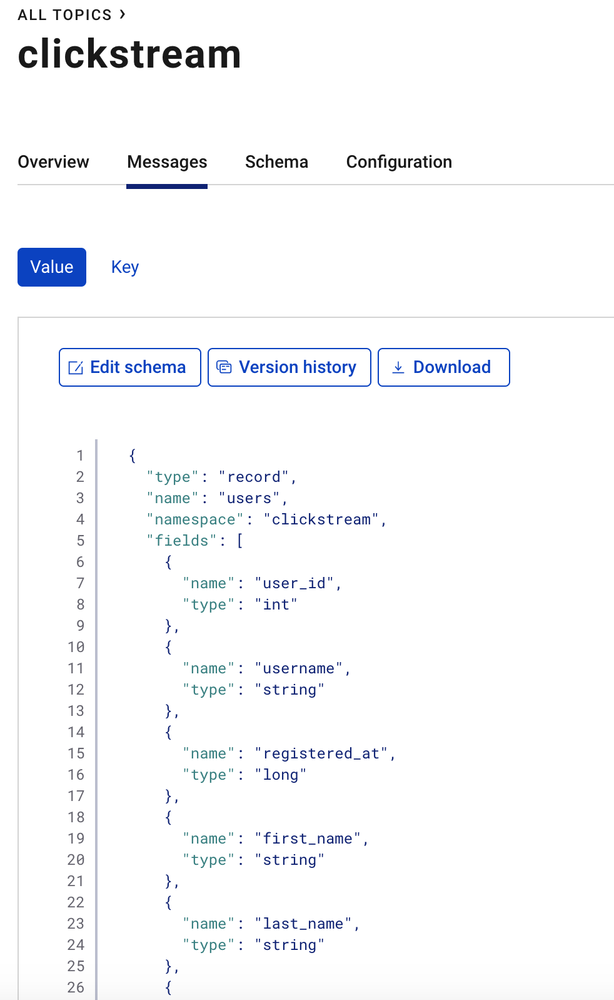
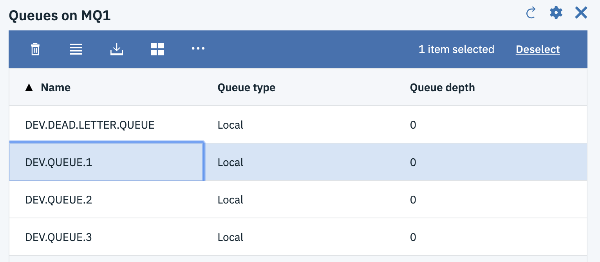
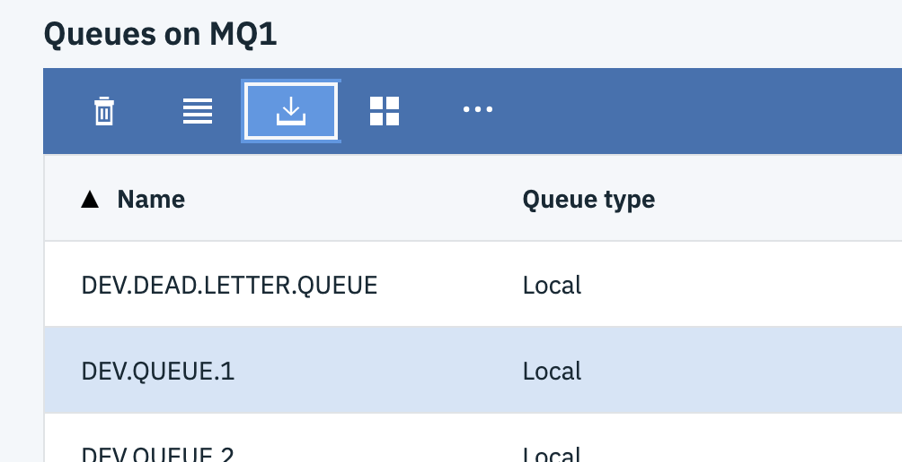
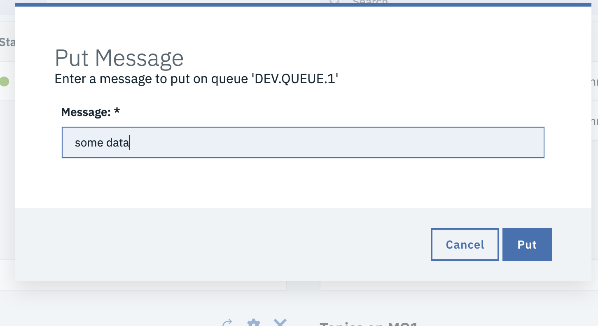
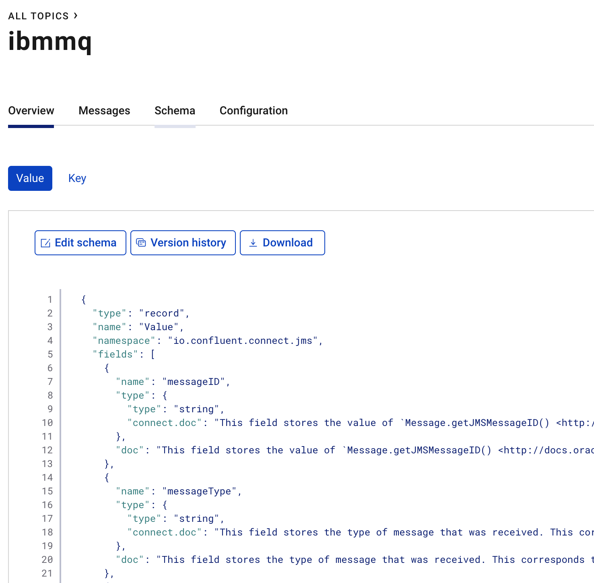

# swift-parser

```text
                                                   +--------------+
+------------+                                     |              |
|            |                                     |              |
|            |         +-----------------+         |  Kafka       |
|  IBMMQ     | +-----> | IBMMQ Connector | +---->  |              |
|            |         |                 |         |              |      +--------------+
|            |         +-----------------+         |              | +--> |              |
+------------+                                     |              |      | KStreams     |
                                                   |              |      | Swift        |
                                                   |              | <--+ | Parse/Route  |
                                                   |              |      |              |
 +------------+        +-----------------+         |              |      +--------------+
 |            |        | JDBC Sink       |         |              |
 |            | <----+ |                 | <----+  |              |
 | Oracle     |        +-----------------+         |              |
 | RDS        |                                    |              |
 |            |                                    |              |
 +------------+                                    |              |
                                                   +--------------+

```

## Prerequisite - downlaod oracle jdbc driver & ibmmq client jars

Please download a oracle jdbc driver and create/place it into **connect/oracle** directory. The jar will be placed into the connector container so that the jdbc sink connecter can locate it.

Likewise, download the IBM MQ client jars and create/place them into `connect/ibmmq` directory so the IBM MQ source connector can load them.

This demo uses `docker`. Please have it installed as well as `docker-compose`.

1. Go to Confluent Cloud and create a Kafka cluster.
1. Install the `ccloud` cli. Instructions are in the Confluent Cloud UI.
1. Install `jq` to parse json responses from rest commands.
1. Install maven (`mvn`) tool.
1. Install sqlplus to connect to Oracle.

## Makefile

```Makefile
# DOCKER COMPOSE ENV VARIABLES
export BOOTSTRAP_SERVERS={{ BOOTSTRAP_SERVERS }}:9092
export SASL_JAAS_CONFIG=org.apache.kafka.common.security.plain.PlainLoginModule   required username='{{ CONFLUENT KEY }}'   password='{{  SECRET }}';
export SASL_JAAS_CONFIG_PROPERTY_FORMAT=org.apache.kafka.common.security.plain.PlainLoginModule   required username='{{ CONFLUENT KEY }}'   password='{{  SECRET }}';
export REPLICATOR_SASL_JAAS_CONFIG=org.apache.kafka.common.security.plain.PlainLoginModule   required username='{{ CONFLUENT KEY }}'   password='{{  SECRET }}';
export BASIC_AUTH_CREDENTIALS_SOURCE=USER_INFO
export SCHEMA_REGISTRY_BASIC_AUTH_USER_INFO={{ SR KEY }}:{{ SR SECRET }}
export SCHEMA_REGISTRY_URL=CHANGEME

# Creds
CLOUD_KEY={{ CONFLUENT KEY }}
CLOUD_SECRET={{  SECRET }}

# Confluent Cloud environment
ENV=
# Confluent Cloud cluster id
CLUSTER=
# Connect hostname ( localhost for docker )
CONNECT=localhost
```

Execute these commands. See the Makefile for details. This will build the docker images to pre-install the connectors (ibmmq & jdbc sink for oracle). This will also create a connect cluster into which you will deploy connector configurations.

```bash
make build
make cluster
# wait a minute for cluster to spinup
# you can run this command to check the status of the connect cluster before moving forward
make status
```

## Make the topics and connectors

Create the topics in you Confluent Cloud Kafka cluster. You will need `ccloud cli installed and be logged in`.

The connect configurations will be deployed into the connect cluster.

```bash
make topic
make connectors
# wait a minute before moving on to the next step

```

## Open the IBM MQ Dashboard

[log into the IBMMQ console](https://localhost:9443/ibmmq/console/login.html) to send swift messages

```conf
UserName=admin
Password=passw0rd
```

## KStream application

Run the kstream swift parser/router. This section uses maven to run the application. You will need to modify the pom.xml to create an UBER jar to run as `java -jar`.

```bash
make kstream
```

## Oracle

This command uses sqlplus

```bash
make oracle
```

```sql
select * from demo.kafka_mt103;
```

## Show AVRO schema

Goto the link below to view the AVRO schema the datagen connector registered to schema registry.


You need to send a message to IBM MQ before the schema will appear in the topic in C3.

- Select `DEV.QUEUE.1` under "Queues on MQ1"



- Add a message




- You can now see the schema assigned to the `ibmmq` topic


