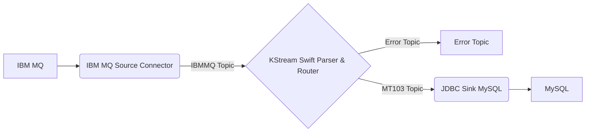
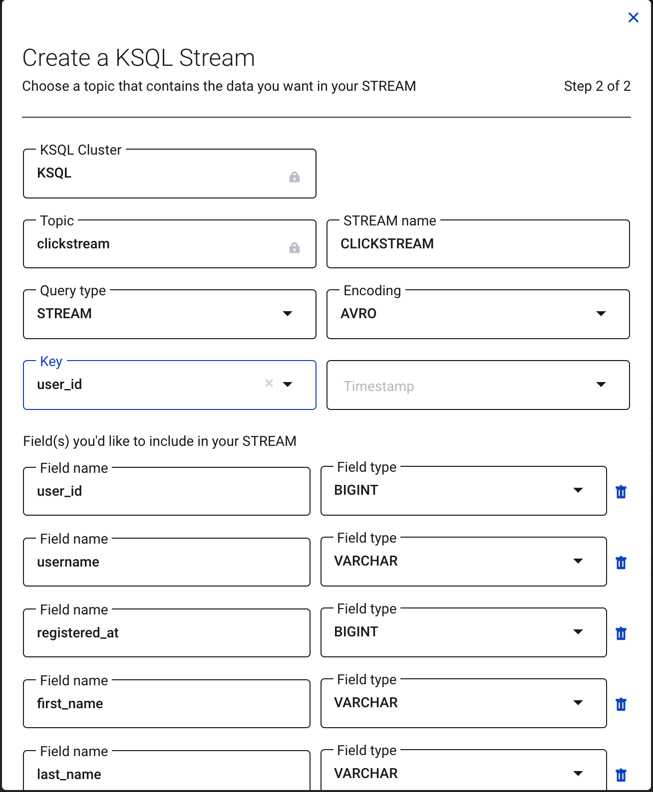
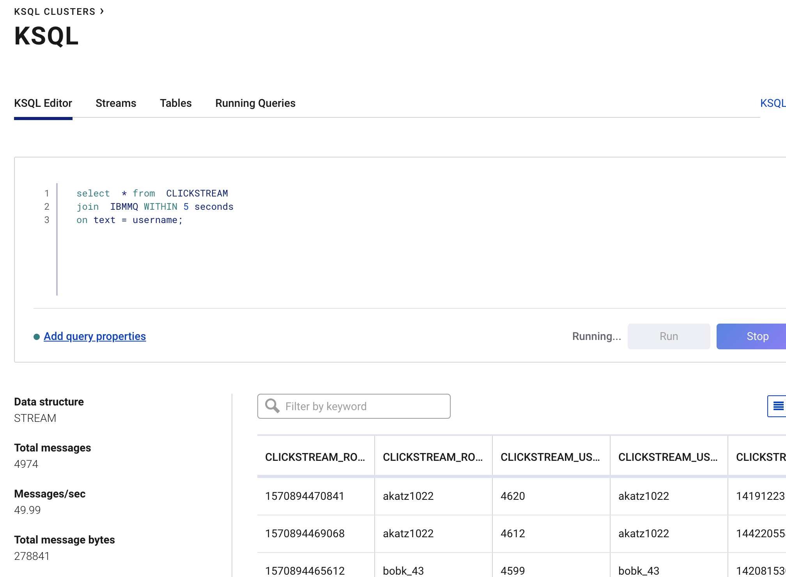

# swift-parser



## Prerequisite - downlaod mysql driver

Please download a mysql jdbc driver and place it into the mysql directory. The jar will be placed into the connector container so that the jdbc sink connecter can locate it.

## IBM MQ

IBM MQ is running in a docker container. IBM MQ source connector will read from it and send it to Confluent Platform.

## Make commands

Execute these commands. See the Makefile for details.

```bash
make build
make cluster
# wait a minute for cluster to spinup
```

## Make the topics and connectors

```bash
make topic
make connect
# wait a minute before moving on to the next step
```

## Open the IBM MQ Dashboard

[log in](https://localhost:9443/ibmmq/console/login.html)

```conf
UserName=admin
Password=passw0rd
```

## Show AVRO schema in C3 topics

Goto the link below to view the AVRO schema the datagen connector registered to schema registry.


You need to send a message to IBM MQ before the schema will appear in the topic in C3.

- Select `DEV.QUEUE.1` under "Queues on MQ1"


- Add a message


- You can now see the schema assigned to the `ibmmq` topic


## AVRO message appear in consumer

Run the ibmmq consumer to see messages coming in from `DEV.QUEUE.1`

```bash
make consumer
```

## KSQL

### Create the stream from the CLICKSTREAM topic in C3

Make sure to leave the timestamp blank to use the topic timestamp by default



## Add anothermessage to DEV.QUEUE.1

You can use the user names `bobk_43` or `akatz1022` to capture clickstreams for those users with a KSQL join.

## Create the Stream for the IBMMQ topic

This time we will use KSQL to create the stream. Paste the KSQL statement into the KSQL Editor.

```sql
CREATE STREAM ibmmq
  WITH (KAFKA_TOPIC='ibmmq',
        VALUE_FORMAT='AVRO');
```

## JOIN the 2 streams

Paste the KSQL statement into the KSQL Editor to perform the join.

```sql
select  * from  CLICKSTREAM
join  IBMMQ WITHIN 5 seconds
on text = username;
```


